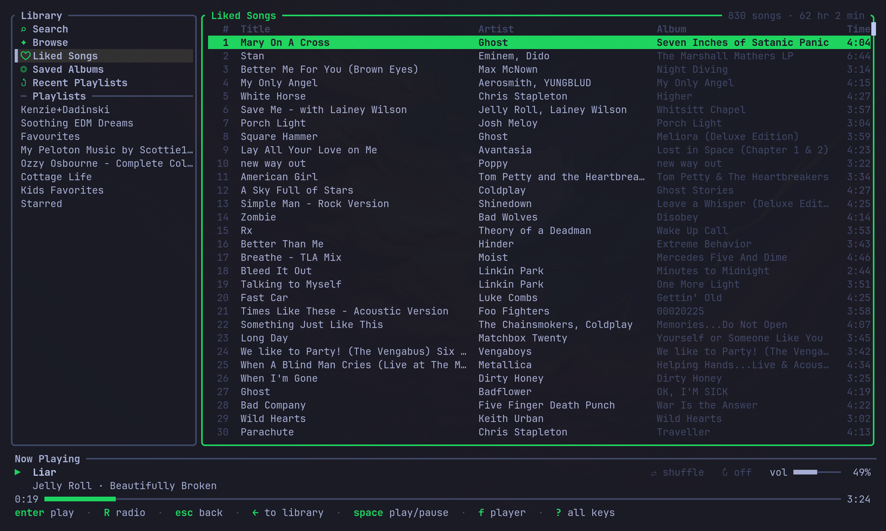
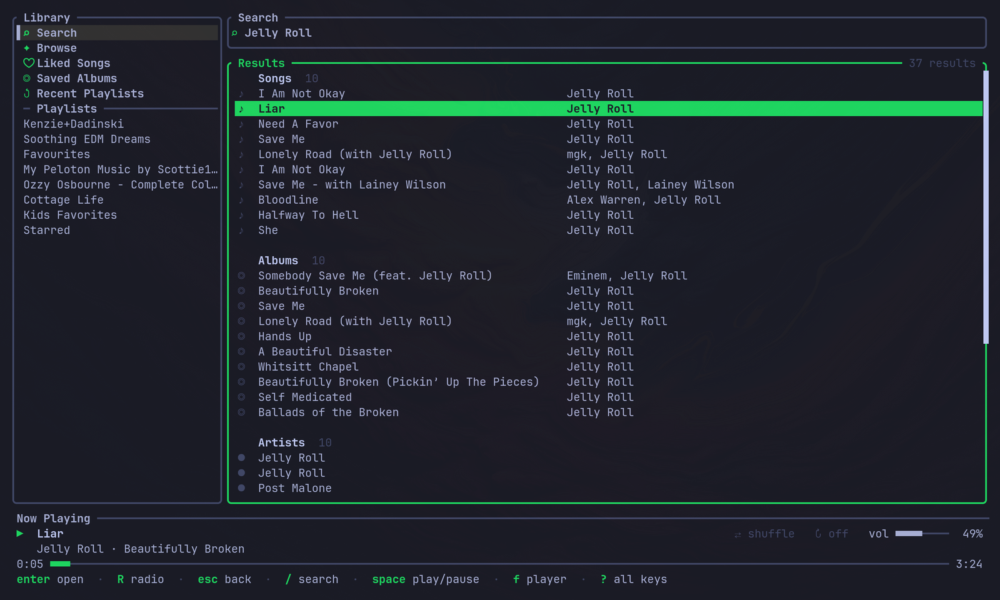
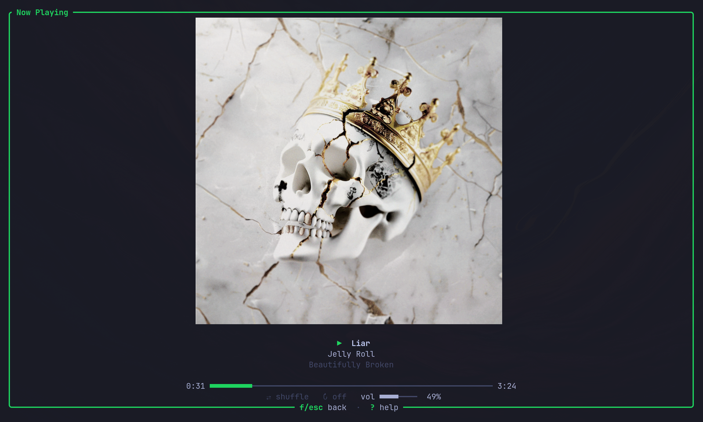

# spotify-tui

A fast Spotify client for the terminal, written in Rust with [ratatui](https://ratatui.rs) and an embedded [librespot](https://github.com/librespot-org/librespot).

The app **is its own Spotify Connect device**. Audio plays from your machine; there's no need for the desktop app or a phone to be open. It also shows up in Spotify's device list, so you can control it from your phone as well.

> Requires **Spotify Premium** (librespot streaming only works with Premium accounts).



| Search | Full-screen player |
| --- | --- |
|  |  |

## Features

- **Your library**: Liked Songs, Saved Albums, all your playlists, and Recent Playlists.
- **Search** across tracks, artists, albums and playlists.
- **Browse** Spotify's live "Browse all" catalogue (genres, moods, charts and their sub-pages), plus radio stations from your top artists and a Recently Played list.
- **Radio** from any track, artist or station (`R`).
- **Full-screen player** with album art. Uses Kitty, Sixel or iTerm2 graphics when your terminal supports them, with coloured half-blocks everywhere else.
- **Playback controls**: play/pause, next/previous, seek, volume, shuffle, repeat.
- **Fast**: lists paint from a local cache instantly and refresh in the background. Playback state comes from player events, not polling, and the screen only redraws when something changes.
- **Responsive layout**: two panes on wide terminals, one pane at a time on narrow ones.
- **Settings** in the app: audio quality (96/160/320 kbps), volume normalisation, gapless playback, device name.

## Install

**Prebuilt binary:** each [release](https://github.com/scottadair/spotify-tui/releases) has `x86_64` and `aarch64` Linux tarballs. They run on any glibc distro with glibc 2.28+ (Debian 10, Ubuntu 20.04, RHEL 8 and newer; not musl distros like Alpine) and need only ALSA (`libasound.so.2`) at runtime. Unpack and put `spotify-tui` on your `PATH`, then skip to step 3:

```sh
tar -xzf spotify-tui-v*-linux-x86_64.tar.gz
install -m755 spotify-tui-v*-linux-x86_64/spotify-tui ~/.local/bin/
```

To build from source instead, start at step 1.

### 1. Prerequisites

- Rust **1.90+**. With [mise](https://mise.jdx.dev), `mise install` in the repo picks up the pinned toolchain; otherwise use [rustup](https://rustup.rs).
- ALSA development headers and `pkg-config` (Linux audio output):

  | Distro | Command |
  | --- | --- |
  | Debian / Ubuntu | `sudo apt install build-essential pkg-config libasound2-dev` |
  | Fedora | `sudo dnf install gcc pkgconf-pkg-config alsa-lib-devel` |
  | Arch | `sudo pacman -S base-devel pkgconf alsa-lib` |

Linux is the tested platform. macOS and Windows may build, but are untested.

### 2. Build

```sh
git clone https://github.com/scottadair/spotify-tui
cd spotify-tui
cargo install --path .     # installs `spotify-tui` into ~/.cargo/bin
```

Or build without installing: `cargo build --release`, and the binary is at `target/release/spotify-tui`.

### 3. Create a Spotify app (one time)

spotify-tui talks to the Spotify Web API through **your own** app, so you need a Client ID:

1. Open the [Spotify Developer Dashboard](https://developer.spotify.com/dashboard) and click **Create app**.
2. Give it any name and description.
3. Add the redirect URI **`http://127.0.0.1:8888/callback`** exactly.
4. Under the APIs used, tick **Web API**, then save.
5. Open the app's settings and copy its **Client ID**.

### 4. First run

```sh
spotify-tui
```

On first run the app asks for your Client ID and saves it to the config file. Then it opens two browser logins, one time each:

1. **Your app** (Web API: library, search, playlists).
2. **The streaming device** (librespot's own client id, which Spotify requires for streaming).

Both tokens are cached, so later launches go straight into the app.

Both logins receive their callback on `127.0.0.1` (ports 8888 and 8898), so those ports must be free during the first run.

## Keys

Press `?` in the app for this list, and `,` for settings.

| Navigate | | Playback | |
| --- | --- | --- | --- |
| `j` `k` / `↓` `↑` | move selection | `space` | play / pause |
| `g` `G` | top / bottom | `n` `p` | next / previous |
| `ctrl-d` `ctrl-u` | half page down / up | `<` `>` | seek −5s / +5s |
| `←` `→` / `h` `l` / `tab` | switch pane | `+` `-` | volume |
| `enter` | open / play | `s` | shuffle |
| `esc` / `backspace` | back | `r` | cycle repeat |
| `/` | search | `R` | start radio from the selection |

| App | |
| --- | --- |
| `f` | full-screen player with album art |
| `,` | settings |
| `?` | key help |
| `q` / `ctrl-c` | quit |

## Configuration

Settings live in `~/.config/spotify-tui/config.toml`. The settings screen (`,`) edits the same file. Changes apply on the next launch.

```toml
client_id = "your-32-character-client-id"
device_name = "spotify-tui"   # name in Spotify Connect device lists
bitrate = 320                 # 96, 160 or 320
initial_volume = 50           # 0-100, used until a volume has been saved
gapless = true
normalisation = false         # even out loudness between tracks
```

Cached data lives in `~/.cache/spotify-tui/`:

| Path | Contents |
| --- | --- |
| `web_token.json` | Web API refresh token |
| `librespot/` | Streaming-device credentials and saved volume. Delete it to re-authorise the device. |
| `data/` | Cached playlists, track lists and browse pages |
| `spotify-tui.log` | Log file; check it first when something goes wrong |

## How it works

- `auth.rs`: PKCE login with a cached, auto-refreshing token for the Web API.
- `player.rs`: librespot session, player and Spirc (the Connect device). The UI's playback state is driven by player events.
- `api/`: Web API client. Paged lists stream in chunks, fetched concurrently.
- `browse.rs`: the Browse page, from Spotify's live catalogue via the web player's GraphQL queries (authorised with the streaming session).
- `cache.rs`: JSON disk cache. Browse pages and top artists use TTLs; playlists and track lists paint from cache, then refresh (skipped if less than 5 minutes old).
- `app.rs`: state and input. `settings.rs`: the settings popup.
- `ui/`: rendering, plus short pane transitions (`ui/anim.rs`) that only move cells and use the terminal's dim attribute, so they suit any colour scheme.

## Caveats

- Not affiliated with or endorsed by Spotify.
- Browse uses undocumented endpoints of Spotify's web player, which can change without notice. The rest of the app uses the public Web API and librespot.
- Spotify rate-limits the Web API per app. That's why you bring your own Client ID, and why librespot's client id is only used for streaming.

## License

Licensed under either of [Apache License, Version 2.0](LICENSE-APACHE) or [MIT license](LICENSE-MIT), at your option.

Unless you explicitly state otherwise, any contribution intentionally submitted for inclusion in this project by you, as defined in the Apache-2.0 license, shall be dual licensed as above, without any additional terms or conditions.
